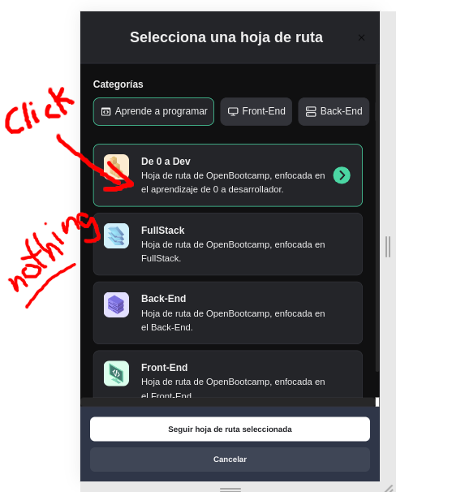
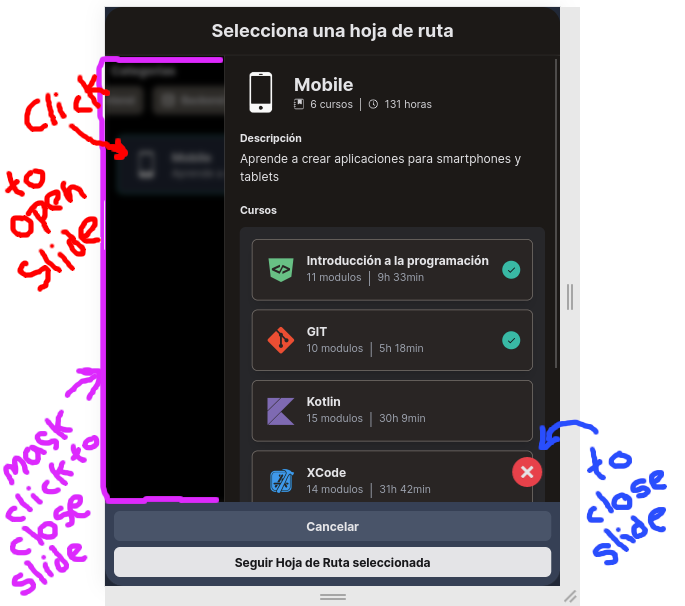
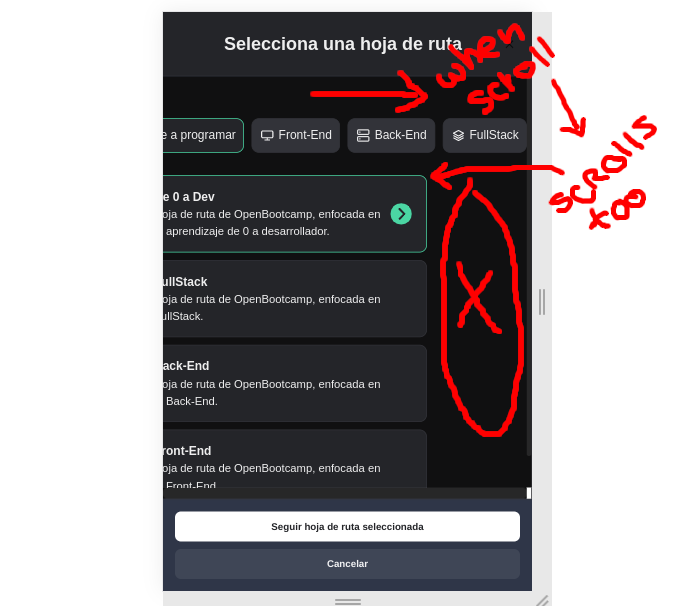
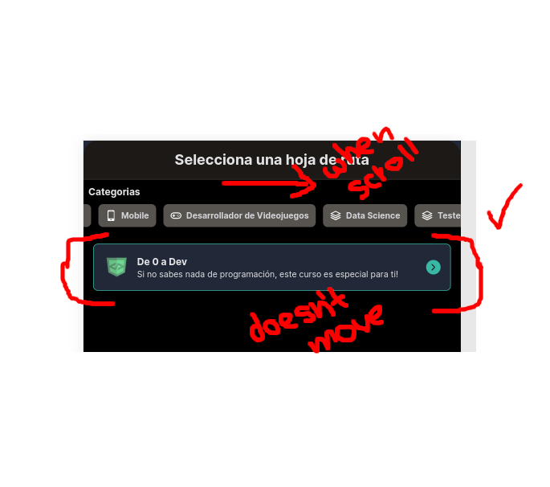
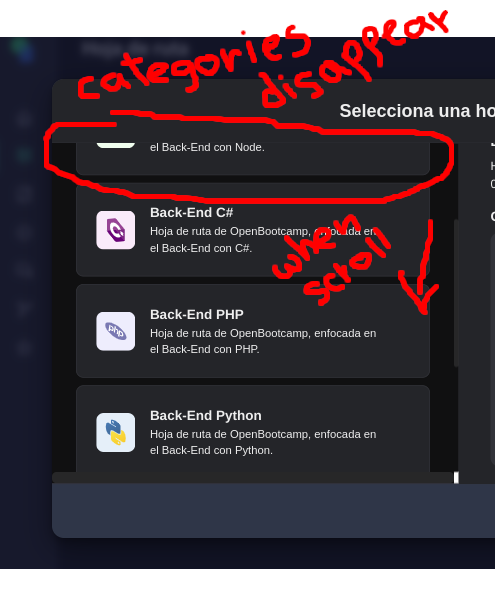
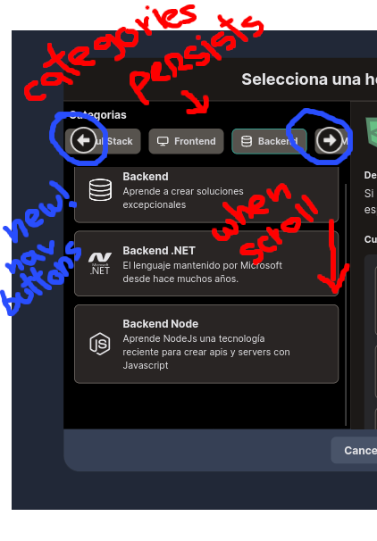
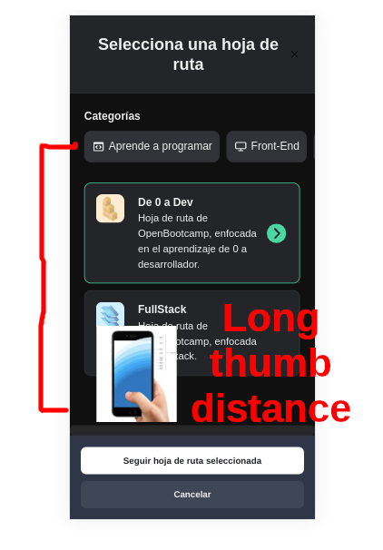
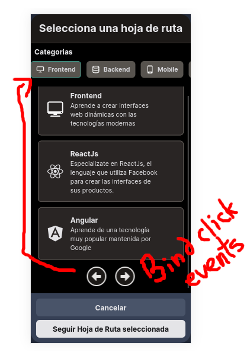

# Propuesta ui - modal Seleción de hoja de Ruta

## Para [Open Bootcamp](https://open-bootcamp.com/)

 

 
 

## Descripción

 
A continuación comparto algunos cambios que me gustarían añadieran al componente modal de selección de hoja de ruta.

Al final de éste documento se muestra una **_Demo_** funcional y un **_CodeSandbox_** para interactuar con el código en tiempo real.

---

 

## Tecnologías y librerías utilizadas

 

-  [Vite](https://vitejs.dev/) - Para la creación del proyecto.

-  [React](https://reactjs.org/) - Para el desarrollo de la interfaz

-  [Typescript](https://www.typescriptlang.org/) - Para el desarrollo del código

-  [Tailwind CSS](https://tailwindcss.com/) - Para el diseño de la interfaz

-  [React Icons](https://react-icons.github.io/react-icons) - Para los iconos de los botones

-  [DevIcon ❤️](https://devicon.dev/) - Para los iconos de las tecnologías

 

---

 

## Implementaciones

 

### **_Slide Info_**

 

#### PROBLEM

En el modo mobile. Al seleccionar una ruta, no se muestra la información de la ruta ni tampoco el listado de los cursos que contiene.

#### FIXED

Se implementó una ventana _**slide**_ para mostrarse cada que se haga click en una ruta.

Se añade un efecto _**blur**_, un _div_ _**mask**_ y un botón _**close**_ para cerrar el slide.

Tanto el _div_ _**mask**_ como el botón _**close**_ al hacer click en ellos, cerrarán el slide.

 

| PROBLEM                                                                      | FIXED                                                                    |
| ---------------------------------------------------------------------------- | ------------------------------------------------------------------------ |
|  |  |

  

### **_Scroll_ Horizontal en Categorias**

 

#### PROBLEM

Al hacer _scroll_ horizontalmente en el componente de categorías, se arrastra también la sección de listado de rutas.

#### FIXED

La sección de listado de rutas ya no se moverá al hacer _scroll_ horizontalmente en el componente de categorías.

 

| PROBLEM                                                                              | FIXED                                                                            |
| ------------------------------------------------------------------------------------ | -------------------------------------------------------------------------------- |
|  |  |

  

### **_Scroll_ Vertical en Listado de Rutas**

 

#### PROBLEM

Al hacer _scroll_ verticalmente en el listado de rutas, el componente de categorías se mueve con el listado haciendolo desaparecer al hacer _scroll_ hacia abajo.

#### FIXED

La sección categorías ya no se moverá al hacer _scroll_ verticalmente en el listado de rutas.

Así mismo, se han implementado unos botones de navegación para poder navegar entre las categorías sin hacer _scroll_.

| PROBLEM                                                                                                                 | FIXED                                                                                                             |
| ----------------------------------------------------------------------------------------------------------------------- | ----------------------------------------------------------------------------------------------------------------- |
|  |  |

  

### **Botones de navegación en modo _mobile_ (UX)**

 

#### PROBLEM

En el modo para dispositivo móviles, la sección de categorías es difícil de acceder para el pulgar de la mano porque están en la parte superior de la pantalla.

#### FIXED

Se implementaron botones de navegación cercanos al dedo pulgar de la mano para poder navegar entre las categorías.

 

| PROBLEM                                                                                                              | FIXED                                                                                                             |
| -------------------------------------------------------------------------------------------------------------------- | ----------------------------------------------------------------------------------------------------------------- |
|  |  |

---

 

## Let's code!

 

[Demo](https://ui-modal-hoja-de-ruta.vercel.app/)

[Play in CodeSandBox](https://codesandbox.io/s/component-ui-hoja-de-ruta-9cl08i)

[GitHub](https://github.com/devcorel/propuestas-open-bootcamp-ui-modal-hoja-de-ruta)

 

---

 

    

---

